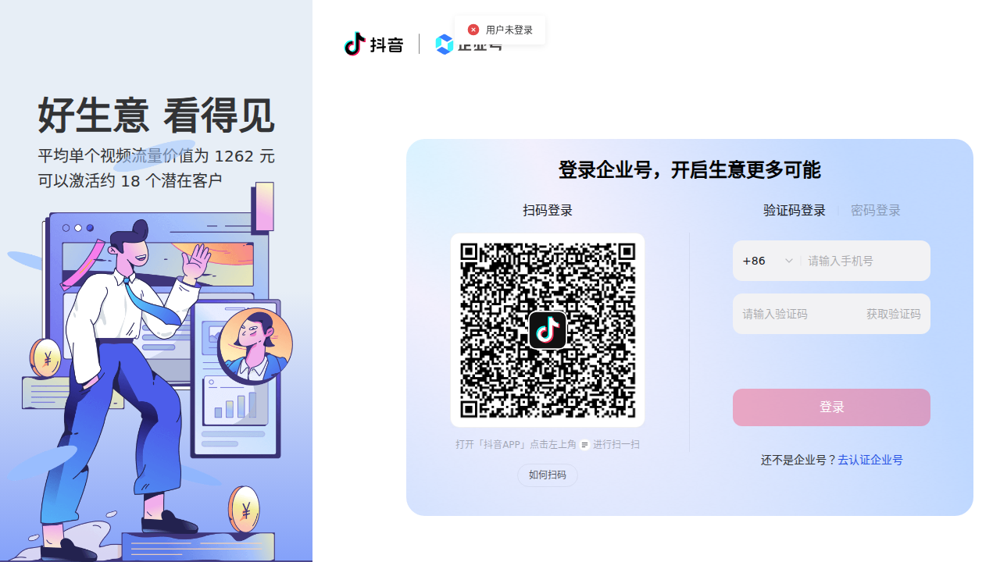

# 2026年抖音最新打法分析

> 抓取时间：2026年3月25日
> 数据来源：抖音电商学习中心 (e.douyin.com)、抖店学习中心 (school.jinritemai.com)

## 页面截图

### 抖音电商学习中心 (e.douyin.com)


### 抖店学习中心 (school.jinritemai.com)


---

## 一、2026年抖音运营核心趋势

### 1. 内容创作升级

| 趋势 | 说明 |
|------|------|
| **垂直领域深耕** | 越来越多创作者选择在细分领域深耕，建立专业形象 |
| **知识付费兴起** | 教程类、干货类内容权重持续提升 |
| **情绪价值内容** | 能引发情感共鸣的内容依然是最强流量密码 |
| **AI辅助创作** | AI工具成为内容创作标配，效率大幅提升 |

### 2. 直播电商演进

- **品牌自播常态化**：几乎所有品牌都建立了自己的直播团队
- **场景化直播**：直播间不再是简单背景，而是沉浸式场景体验
- **达播+品播协同**：达人直播与品牌直播形成组合拳策略
- **直播时长延长**：长时段直播成为获取更多流量的关键

### 3. 短视频+直播联动

- 短视频引流→直播间转化→私域沉淀
- 内容种草→搜索承接→即时转化
- 多账号矩阵运营成为主流

---

## 二、流量获取策略

### 1. 算法机制解析

```
核心指标权重：
├── 完播率（首要指标）
├── 互动深度（评论、分享权重提升）
├── 粉丝粘性（关注、复看率）
├── 转化效果（商品点击、购买）
└── 内容质量（原创度、清晰度）
```

### 2. 付费流量投放

| 工具 | 适用场景 | 关键策略 |
|------|----------|----------|
| **千川投放** | 电商转化 | ROI导向，精准人群定向 |
| **DOU+** | 内容加热 | 测试爆款内容潜力 |
| **品牌广告** | 品牌曝光 | 大事件营销、新品发布 |

### 3. 免费流量获取

- **蹭热点**：及时跟进热门话题、音乐、挑战赛
- **SEO优化**：标题、话题标签关键词布局
- **发布时间**：根据目标用户活跃时间调整
- **互动运营**：评论区维护、粉丝群运营

---

## 三、电商变现路径

### 1. 商品卡优化

```
优化要点：
├── 标题优化（关键词+卖点+规格）
├── 主图设计（首图吸睛+详情图展示）
├── 详情页（痛点+解决方案+信任背书）
├── 评价管理（好评置顶+差评处理）
└── 价格策略（对比价+优惠券+满减）
```

### 2. 私域运营

- **粉丝群建设**：建立核心粉丝社群
- **会员体系**：积分、等级、专属福利
- **复购激励**：老客专享优惠、会员日活动
- **社群运营**：定期互动、专属内容、福利发放

### 3. 选品策略

- **数据选品**：通过数据工具分析市场趋势
- **差异化定位**：避开红海，寻找细分机会
- **供应链优化**：稳定货源、快速响应
- **利润空间**：确保足够的利润支持投放

---

## 四、2026年新趋势预判

### 1. AI工具全面渗透

| 应用场景 | AI工具 |
|----------|--------|
| 内容创作 | AI脚本、AI视频生成 |
| 直播辅助 | AI主播、AI客服 |
| 数据分析 | AI预测、智能推荐 |
| 投放优化 | AI自动出价、智能投放 |

### 2. 全域经营

```
多平台联动：
├── 抖音（主阵地）
├── 小红书（种草）
├── 微信（私域）
├── 淘宝/天猫（补充渠道）
└── 线下门店（体验+履约）
```

### 3. 合规经营升级

- **内容合规**：避免违规词汇、敏感内容
- **税务合规**：依法纳税，规范财务
- **广告合规**：遵守广告法规定
- **数据合规**：保护用户隐私

### 4. 新形式探索

- **虚拟人直播**：24小时不间断直播
- **互动视频**：用户参与剧情走向
- **AR/VR体验**：沉浸式购物体验
- **短剧营销**：内容与营销深度融合

---

## 五、实操建议

### 新手起步

1. **账号定位**：明确赛道和人设
2. **内容规划**：制定内容日历
3. **对标学习**：分析同类优质账号
4. **数据复盘**：每周分析数据优化

### 进阶运营

1. **矩阵布局**：多账号协同运营
2. **团队建设**：专业分工提效
3. **工具使用**：善用各类运营工具
4. **持续学习**：紧跟平台规则变化

### 高阶打法

1. **品牌化运营**：从卖货到卖品牌
2. **跨界合作**：异业联盟破圈
3. **IP打造**：塑造独特的品牌IP
4. **资本运作**：融资、并购、上市

---

## 六、常见问题 FAQ

**Q: 新账号如何快速起号？**
A: 建议从垂直领域切入，持续输出优质内容，配合适量投放测试。

**Q: 如何提高直播转化率？**
A: 优化直播话术、场景布置、商品组合，建立信任感和紧迫感。

**Q: 千川投放ROI低怎么办？**
A: 检查人群定向是否精准，素材是否吸引人，落地页体验是否流畅。

**Q: 如何应对流量下滑？**
A: 分析数据找原因，可能是内容疲劳、竞争加剧、算法调整等。

---

## 七、工具推荐

| 类型 | 工具 |
|------|------|
| 数据分析 | 蝉妈妈、飞瓜数据、抖查查 |
| 内容创作 | 剪映、醒图、Canva |
| 投放管理 | 千川后台、巨量引擎 |
| 选品工具 | 抖店后台、1688、淘宝联盟 |

---

## 八、总结

2026年的抖音生态已经非常成熟，机会仍然存在但门槛提高。成功的关键在于：

1. **持续学习**：紧跟平台变化
2. **数据驱动**：用数据指导决策
3. **内容为王**：优质内容是根本
4. **用户思维**：从用户需求出发
5. **长期主义**：拒绝急功近利

---

> ⚠️ 免责声明：本分析基于公开信息整理，仅供参考。具体运营策略请结合实际情况调整，并遵守平台规则及法律法规。

---

*文档生成时间：2026-03-25*
*数据来源：抖音电商学习中心、抖店学习中心*
